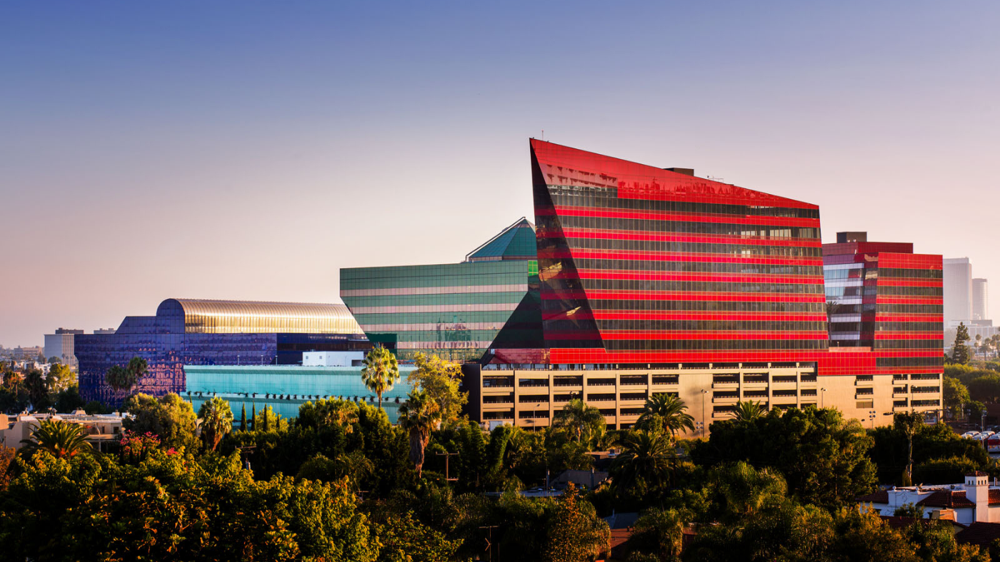

# Welcome to the Omar Lab!
{: .display-4}
 
We are part of the [Department of Computational Biomedicine](https://www.cedars-sinai.edu/health-sciences-university/research/departments-institutes/computational-biomedicine.html) and the [Samuel Oschin Comprehensive Cancer Institute](https://www.cedars-sinai.edu/health-sciences-university/research/departments-institutes/cancer.html) at [Cedars-Sinai Medical Center](https://www.cedars-sinai.org/home.html).
{: .welcomefont}

{:style="max-width: 100%; height: auto;"}

Research in the lab is focused on developing robust AI-powered predictive and prognostic tools for cancer patients informed by the tumor microenvironment composition. Our ultimate goal is to develop powerful tools that can guide management decisions based on each patient's unique tumor biology and risk profile.
{: .welcomefont}

We are located in the Green (Dry lab) and Blue (Wet lab) Building of the Pacific Design Center.
{: .welcomefont}

{:style="max-width: 100%; height: auto;"}
